# Curso-de-introduccion-a-Selenium-con-Python
Curso de introduccion a Selenium con Python realizado en Platzi

**Contenido**

[Clase 1 Bienvenida al curso](#Clase-1-Bienvenida-al-curso)

[Clase 2 Historia de Selenium](#Clase-2-Historia-de-Selenium)

[Clase 3 Otras herramientas de testing y automatización](#Clase-3-Otras-herramientas-de-testing-y-automatización)

[Clase 4 Configurar entorno de trabajo](#Clase-4-Configurar-entorno-de-trabajo)

[Clase 5 ¡Hola, Mundo!](#Clase-5-¡Hola-Mundo!)

[Descarga del archivo y el Chrome Driver](#Descarga-del-archivo-y-el-Chrome-Driver)

[Clase 6 Encontrar elementos con find_element](#Clase-6-Encontrar-elementos-con-find_element)

[Clase 7 Preparar assertions y test suites](#Clase-7-Preparar-assertions-y-test-suites)

[Clase 8 Entender las clases WebDriver y WebElement](#Clase-8-Entender-las-clases-WebDriver-y-WebElement)

[Clase 9 Manejar form, textbox, checkbox y radio button](#Clase-9-Manejar-form-textbox-checkbox-y-radio-button)

[Clase 10 Manejar dropdown y listas](#Clase-10-Manejar-dropdown-ylistas)

[Clase 11 Manejar alert y pop-up ](#Clase-11-Manejar-alert-y-pop-up)

[Clase 12 Automatizar navegación](#Clase-12-Automatizar-navegación)

[Clase 13 Demora implícita y explícita](#Clase-13-Demora-implícita-y-explícita)

[Clase 14 Condicionales esperadas](#Clase-14-Condicionales-esperadas)

[Clase 15 Agregar y eliminar elementos](#Clase-15-Agregar-y-eliminar-elementos)

[Clase 16 Elementos dinámicos](#Clase-16-Elementos-dinámicos)

[Clase 17 Controles dinámicos](#Clase-17-Controles-dinámicos)

[Clase 18 Typos](#Clase-18-Typos)

[Clase 19 Ordenar tablas](#Clase-19-Ordenar-tablas)

[Clase 20 Data Driven Testing (DDT)](#Clase-20-Data-Driven-Testing-(DDT))

[Clase 21 Page Object Model (POM)](#Clase-21-Page-Object-Model-(POM))

[Clase 22 Realizar una prueba técnica](#Clase-22-Realizar-una-prueba-técnica)

[Clase 23 Conclusiones](#Clase-23-Conclusiones)

## Clase 1 Bienvenida al curso

Recomendaciones de cursos antes de iniciar con el de Selenium

- Curso de Introduccion al pensamiento computacional con Python 

- Curso de Programación Orientada a Objetos: POO

- Curso de desarrollo web online

- Curso de fundamentos de pruebas de software

## Clase 2 Historia de Selenium

**¿Qué es selenium?**

Es una "Suite de herramientas para automatizacion de navegadores", tambien es asociado a testing o web scraping

Selenium es compatible con navegadores como Firefox, Internet explorer, Google Chrome, Opera, Safari 

Tambien es compatible con distintos lenguajes de programacion como JAVA, C# Ruby, Python, PHP, JavaScript, PERL y Kotlin

Selenium **No es una herramienta de testing o web scraping**, se puede utilizar para esas tareas pero su desempeño en las mismas puede no ser el optimo

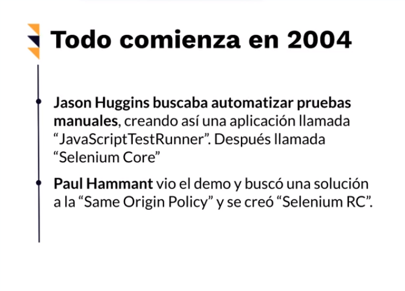

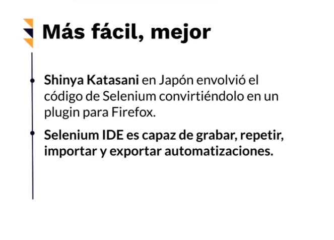

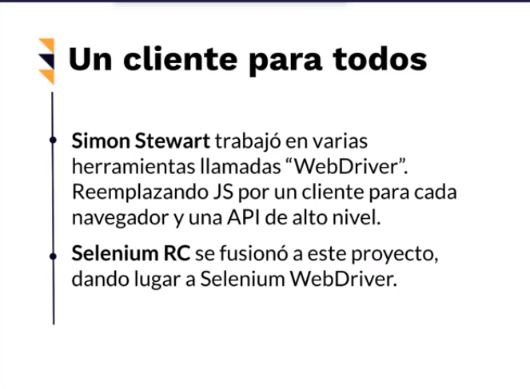

**Origen del nombre**

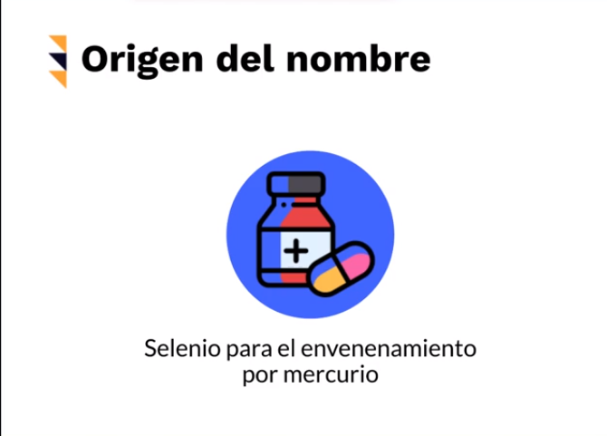

La compañia de desarrollo que creo Selenium originalmente tenia un competidor llamado Mercurial.
Cuando una persona padece intoxicación por mercurio debe consumir suplementos hechos a base de selenio para poderse curar.

Entonces el equipo de desarrollo considero una buena idea utilizar el nombre de Selenium porque como tal ofrecian una cura para lo que este competidor hacia u ofrecia.

**Caracteristicas, pros y contras de Selenium IDE**

**Pros**

- Excelente para iniciar en testing y pruebas unitarias teniendo en cuenta que funciona a base de clicks en los elementos del sitio web 

- No requiere saber programar lo que lo hace bastante util para novatos

- Exporta Scripts para Selenium RC(remote control) y Selenium WebDriver

- Genera reportes como cuanto duro una prueba, que acciones se tomaron, errores y fallas que hubo durante las pruebas

**Contras**

- Disponible solo para Firefox y Chrome

- No soporta DDT(Data-Driven-Testing), no es posible colocar datos para realizar multiples pruebas

**Caracteristicas, pros y contras de Selenium RC(Remote Control)**

**Pros**

- Soporte para varias plataformas, navegadores y lenguajes de programacion

- Operaciones logicas y condicionales cuando realizamos pruebas

- soporta DDT(Data-Driven-Testing)

- **Posee una API madura** con la que se puede llevar a cabo metodos y funciones que hacen mas agiles las pruebas

**Contras**

- Complejo de instalar (requiere instalar varios archivos)

- Necesita de un servidor corriendo (con el cual se comunica antes de poder enviar las interacciones al navegador)

- Comandos redundantes en su API (Pueden parecer a metodos que hagan lo mismo, pero por debajo funcionan de manera distinta)

- Navegacion no tan realista (Es mas robotica y rigida)

**Caracteristicas, pros y contras de Selenium WebDriver(Herramienta a utilizar en el curso)**

**Pros**

- Soporte para multiples lenguajes

- Facil de instalar

- Comunicación directa con el navegador (No requiere de un servidor intermedio)

- Interacción más realista (Como pensar que hace una persona y trasladarlo a Selenium)

**Contras**

- No soporta nuevos navegadores tan rápido o nuevas actualizaciones

- No genera reportes o resultados de pruebas

- Requiere de saber programar

**Selenium Grid**(Es un complemento)

**Caracteristicas**

- Se utiliza junto a Selenium RC(Remote Control)

- Permite correr pruebas en paralelo

- Conveniente para ahorrar tiempo

## Clase 3 Otras herramientas de testing y automatización

Selium puede no ser la herramienta de testing y automatizacion mas eficiente por lo cual hay que considerar la existencia de otro tipo de herramientas

**Puppeteer**

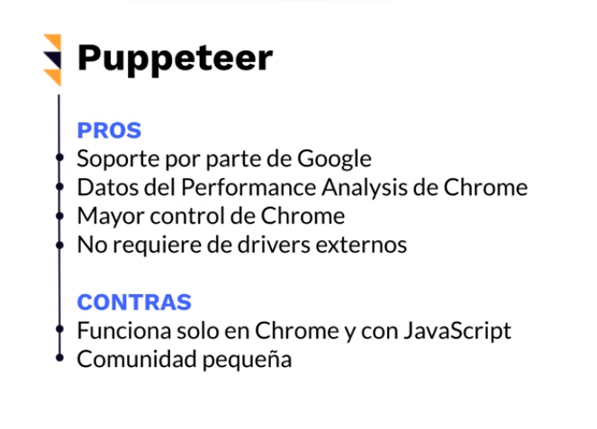

Tiene una comunidad pequeña por lo cual aun se esta desarrollando 

**Cyperss.io**

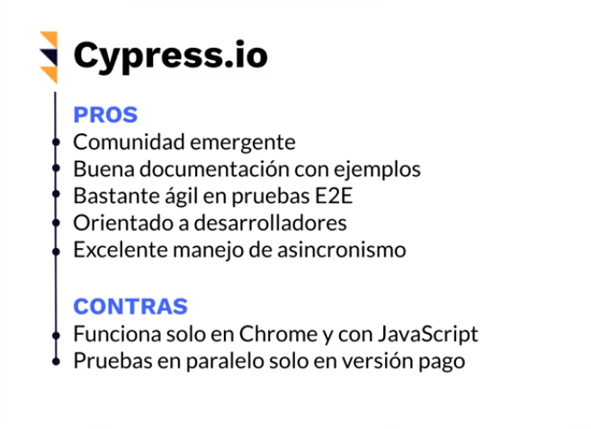

Una de sus ventajas mas importantes es que tiene un excelente manejo del asincronimo lo cual hace que las esperas puedan ser dinamicas y se puedan manejar de forma sencilla

**¿Cuál es la mejor opción?**

Se debe tomar en cuenta lo siguiente

- ¿Cuál es lenguaje de programación con el que mas esta familiarizado?

- ¿Qué lenguaje de programación utiliza el equipo de trabajo?

- El proyecto de trabajo requiere grandes llamadas de asincronismo o no

- Si se quiere hacer una automatizacion para hacer una tarea mas sencilla

**Porque usar Selenium durante el curso**

- Facil de utilizar

- Es compatible con muchos navegadores

- Se pueden implementar diversos lenguajes de programación que para el caso sera Python

- Se pueden lograr grandes procesos de automatización y testing

## Clase 4 Configurar entorno de trabajo

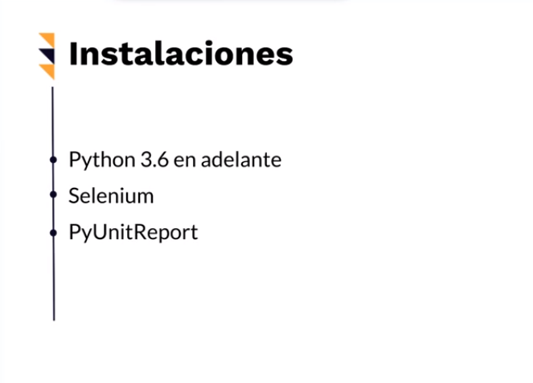

Pasos a ejecutar en la terminal estos sirven para entornos en Linux mint, basados en ubuntu o debian.

Tener en cuenta verificar si se pueden seguir los mismos pasos en windows

**paso 1**

python3 --version (se debe tener una version igual o superior a Python 3.6)

**paso 2** 

pip3 install selenium

- en caso de que no este instalado pip

    - sudo apt-get install python3-pip
    - nuevamente ejecutar (pip3 install selenium)

**paso 3**

pip3 install pyunitreport

**pyunitreport es una libreria que sirve para generar reportes en html**

## Clase 5 ¡Hola, Mundo!

Con las herramientas ya instaladas se descarga un archivo adicional que es el driver del navegador para comunicar Selenium con el mismo pero antes hay que revisar conceptos pertenecientes a Unittest que pertenece a una libreria de Python con la cual se realizan pruebas unitarias para obtener la informacion de lo que ocurre con las automatizaciones

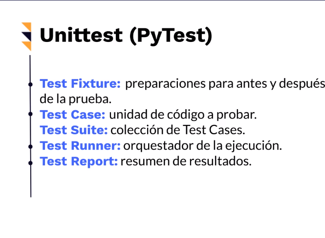

- **Test Fixture**

Es todo lo que va a ocurrir antes y despues de una automatización y despues realiza una serie de acciones cuando termine el caso de prueba que se esta realizando

**Test Case** 

Es una unidad de codigo con el cual se indica a selenium que es lo que se requiere hacer o en su defecto alguna funcion que se quiere hacer

**Test Suite**

Es la coleccion de distintas pruebas o automatizaciones en un solo archivo para que se puedan ejecutar todos de forma secuencial

**Test Runner**

Es la parte que se va a encargar de dirigir que se va a ejecutar, en que orden, como y resultados a brindar

**Test Report**

Es la parte que va a mostrar por ejemplo cuantas pruebas corrieron, tiempo de ejecucion, si hubo errores o no

### Descarga del archivo y el Chrome Driver

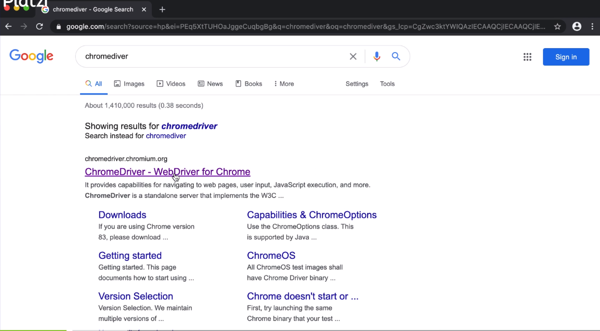

Descargar la version mas reciente 

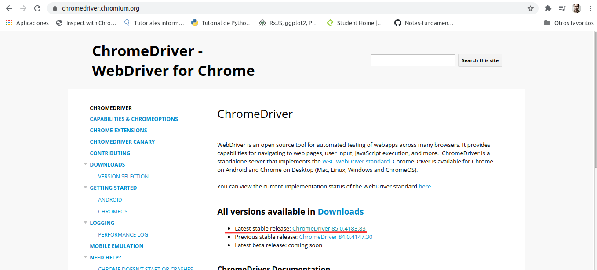

Opciones para el sistema operativo

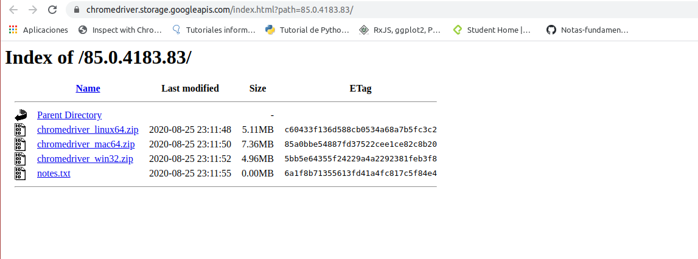

Extraer el archivo preferiblemente en la carpeta en al que se este realizando el curso

Luego abrir el editor de codigo que se tenga y guardar dentro de la carpeta 

un archivo llamado hello_world.py

y a continuacion escribir las siguientes instrucciones:

```
import unittest
from pyunitreport import HTMLTestRunner
from selenium import webdriver

class HelloWorld(unittest.TestCase):

import unittest
from pyunitreport import HTMLTestRunner
from selenium import webdriver

class HelloWorld(unittest.TestCase):

    def setUp(self):
        self.driver = webdriver.Chrome(executable_path= './chromedriver')
        driver = self.driver
        driver.implicitly_wait(10)

    
    def test_hello_world(self):
        driver = self.driver
        driver.get('https://www.platzi.com')

    
    def tearDown(self):
        self.driver.quit()


if __name__ == "__main__":
    unittest.main(verbosity = 2, testRunner = HTMLTestRunner(output = 'reportes', report_name = 'hello-world-report'))
```

import unittest, esta libreria nos sirve para traer todas nuestras pruebas

from pyunitreport import HTMLTestRunner, Nos ayuda a orquestar cada una de las pruebas que estamos ejecutando junto con los reportes

from selenium import webdriver, Desde el modulo de Selenium se importa webdriver para comunicarnos con el navegador

class HelloWorld(unittest.TestCase): Hace referencia a los casos de prueba con unittest.TestCase

Despues vienen los Test Fixture que van a estar definidos como metodos y como lo indica la sintaxis

A continuacion se indica que self.driver es igual a webdriver y el nombre del navegador que en este caso es Chrome y se pasa como parametro la ruta de ejecucion del archivo del driver descargado en la carpeta del curso

luego con la palabra driver se hace igual a self.driver para no estar escribiendo en cada linea self.driver

y luego a traves de driver.implicitly_wait(10) que espere implicitamente 10 segundos antes de realizar la siguiente accion

```
    def setUp(self):
        self.driver = webdriver.Chrome(executable_path= './chromedriver')
        driver = self.driver
        driver.implicitly_wait(10)
```

El siguiente metodo debe iniciar con la palabra test para que asi la pueda identificar el Test Runner

nuevamente con la palabra driver se hace igual a self.driver para no estar escribiendo en cada linea self.driver

y se le indica a traves de driver.get que traiga la direccion que se quiere analizar

```
    def test_hello_world(self):
        driver = self.driver
        driver.get('https://www.platzi.com')


```
Este es el otro Test Fixture que va dar la salida a lo que estemos escribiendo

Esto es para cerrar la ventana del navegador para evitar una fuga de recursos o que el navegador pueda ponerse lento

```
    def tearDown(self):
        self.driver.quit()
```

Dentro del metodo main se pasan las banderas verbosity, testRunner para que genere los reportes correspondientes

```
if __name__ == "__main__":
    unittest.main(verbosity = 2, testRunner = HTMLTestRunner(output = 'reportes', report_name = 'hello-world-report'))
```

Asi queda el archivo como tal 


Luego de esto pasar a la terminal y ejecutar el archivo que lo que va a hacer es abrir el navegador Chrome, segundos despues se cierra y aparece el reporte

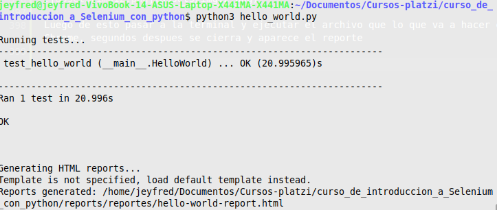

añadir a este mismo archivo despues del metodo test_hello_world, el metodo

```
    def test_visit_wikipedia(self):
        driver = self.driver
        driver.get('https://www.wikipedia.org')
```

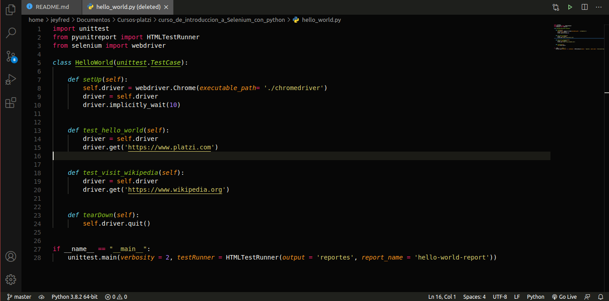


ejecutar en la terminal y por ultimo dentro de la carpeta del curso se va a generar una carpeta llamada reports que contiene a reportes y esta carpeta tiene un archivo llamada hello-world-report.html.

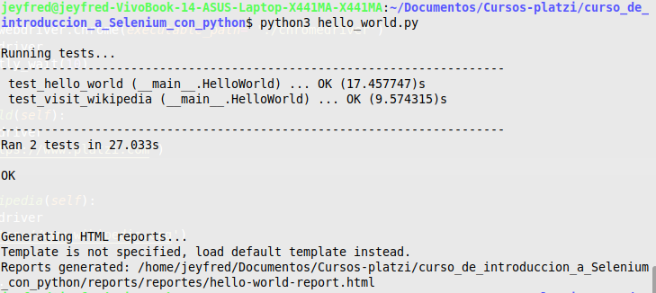

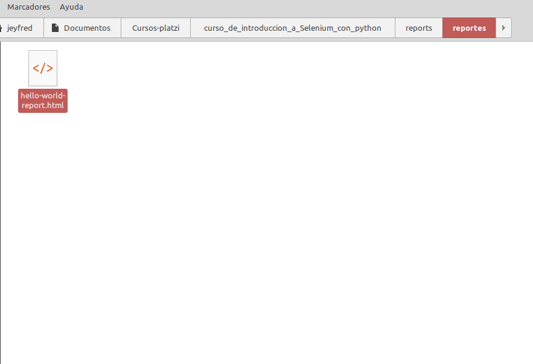

abrir con Chrome para visualizar el reporte donde aparece la duracion y el estatos si paso o fallo 

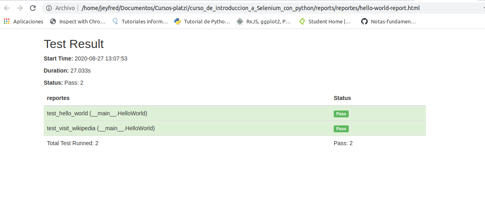

para que las ventanas no se ejecuten por aparte se hace un cambio y se implementa el decorador classmethod al inicio y finalizacion del Test Fixture y ademas se cambian todas las palabras self por cls


```
import unittest
from pyunitreport import HTMLTestRunner
from selenium import webdriver

class HelloWorld(unittest.TestCase):


    @classmethod
    def setUp(cls):
        cls.driver = webdriver.Chrome(executable_path= './chromedriver')
        driver = cls.driver
        driver.implicitly_wait(10)

    
    def test_hello_world(self):
        driver = self.driver
        driver.get('https://www.platzi.com')


    def test_visit_wikipedia(self):
        driver = self.driver
        driver.get('https://www.wikipedia.org')
    

    def tearDown(cls):
        cls.driver.quit()


if __name__ == "__main__":
    unittest.main(verbosity = 2, testRunner = HTMLTestRunner(output = 'reportes', report_name = 'hello-world-report'))

```

y nuevamente se pasa a ejecutar como en los pasos anteriores

## Clase 6 Encontrar elementos con find_element

el siguiente paso es encontrar e identificar cada uno de los elementos que componen a un sitio web para que podamos interactuar con ellos

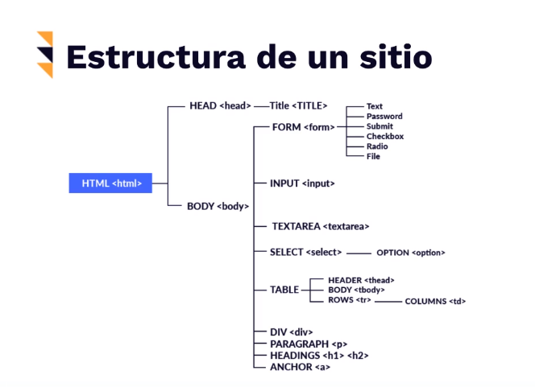

los selectores seran los que nos den la oportunidad de llegar a los elementos a traves del codigo y ejecutar las acciones que le indiquemos a Selenium

la forma en la que podemos encontrarlos es a traves de:

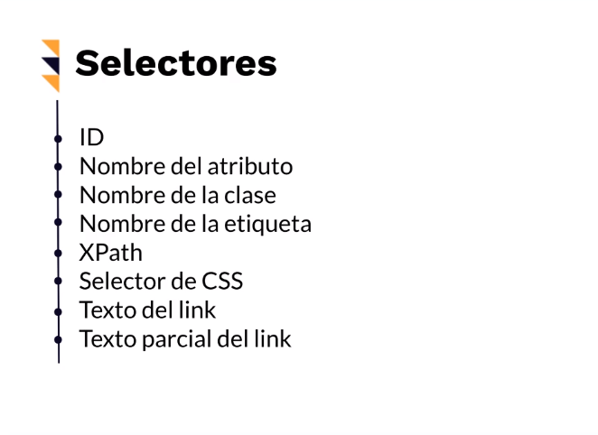

pagina a analizar http://demo-store.seleniumacademy.com/

La estructura de codigo basica para hacer automatizaciones es la siguiente

```
import unittest

from selenium import webdriver

class HomePageTest(unittest.TestCase):
    

    def setUp(self):
        pass


    def tearDown(self):
        pass


if __name__ == "__main__":
    pass
```

Se crea el codigo a traves de un archivo llamado searchtests.py a continuacion dejo el codigo de esta clase porque en la siguiente cambia la clase y los metodos

**searchtests.py**

```
import unittest

from selenium import webdriver

class HomePageTest(unittest.TestCase):


    def test_search_text_field(self):
        search_field = self.driver.find_element_by_id("search")

    
    def test_search_text_field_by_name(self):
        search_field = self.driver.find_element_by_name("q")


    def test_search_text_field_by_class_name(self):
        search_field = self.driver.find_element_by_class_name("input-text")


    def test_search_button_ennabled(self): 
        button = self.driver.find_element_by_class_name("button")


    def test_count_of_promo_banner_images(self):#Metodo para contar cuantas imagenes hay de promocion en el banner
        banner_list = self.driver.find_element_by_class_name("promos")
        banners = banner_list.find_elements_by_tag_name('img')
        self.assertEqual(3, len(banners))


    def test_vip_promo(self):
        vip_promo = self.driver.find_element_by_xpath('//*[@id="top"]/body/div/div[2]/div[2]/div/div/div[2]/div[1]/ul/li[4]/a/img')


    def test_shopping_cart(self):
        shopping_cart_icon = self.driver.find_element_by_css_selector("div.header-minicart span.icon")


    def tearDown(self):
        self.driver.quit()


if __name__ == "__main__":
    unittest.main(verbosity= 2)
```


Las siguientes lineas de codigo se relacionan con las busquedas de las imagenes que tambien se encuentran en el archivo

**Busqueda de la barra de busqueda**

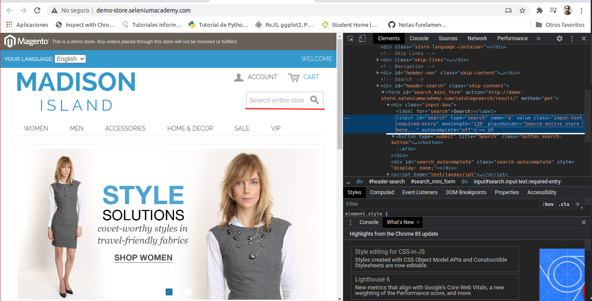

**Busqueda por el Id**

```
    def test_search_text_field(self):
        search_field = self.driver.find_element_by_id("search")

```
**Busqueda por el nombre**

```
    def test_search_text_field_by_name(self):
        search_field = self.driver.find_element_by_name("q")

```

**Busqueda por la clase**

```
   def test_search_text_field_by_class_name(self):
        search_field = self.driver.find_element_by_class_name("input-text")

```

**Busqueda para verificar que el boton de la barra de busqueda este disponible**


**Busqueda por la clase**

```
    def test_search_button_ennabled(self): 
        button = self.driver.find_element_by_class_name("button")
```

**Busqueda para listar imagenes de las promos de la pagina**

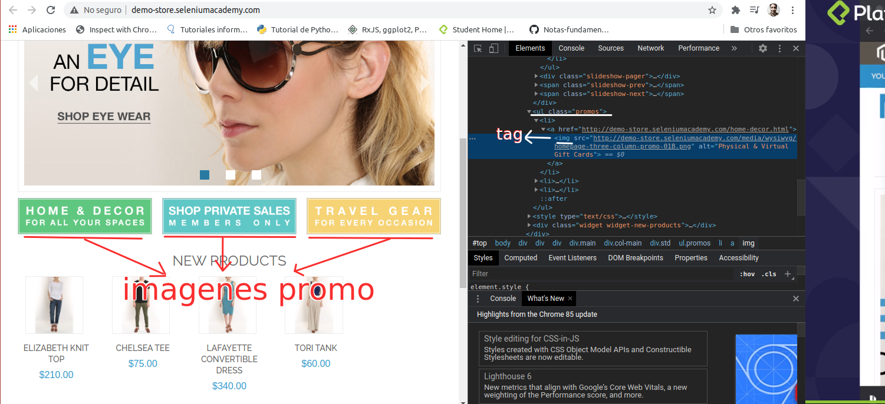

***por la clase y el selector**

```
    def test_count_of_promo_banner_images(self):#Metodo para contar cuantas imagenes hay de promocion en el banner
        banner_list = self.driver.find_element_by_class_name("promos")
        banners = banner_list.find_elements_by_tag_name('img')
        self.assertEqual(3, len(banners))
```

**Busqueda de la imagen principal del banner**

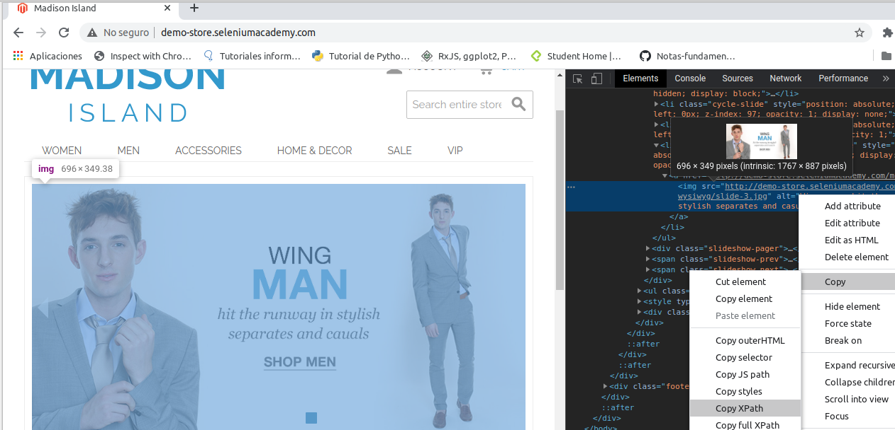

**Busqueda por el Xpath**

```
def test_vip_promo(self):
        vip_promo = self.driver.find_element_by_xpath('//*[@id="top"]/body/div/div[2]/div[2]/div/div/div[2]/div[1]/ul/li[4]/a/img')
```
**Busqueda del carro de compras a traves de css**

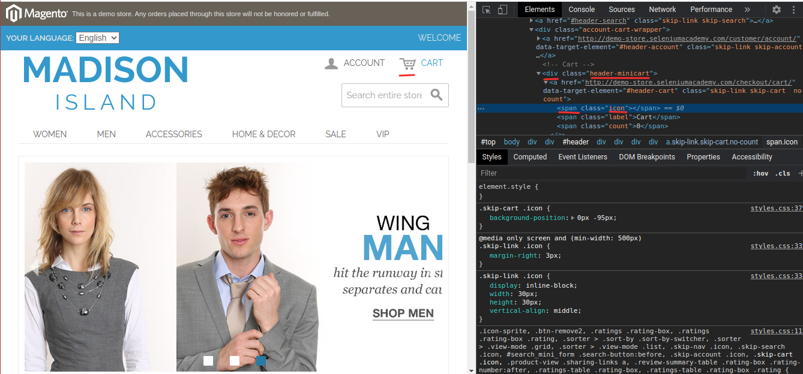

```
def test_shopping_cart(self):
        shopping_cart_icon = self.driver.find_element_by_css_selector("div.header-minicart span.icon")
```

Luego ejecutar el archivo en la terminal para verificar que se realicen los test

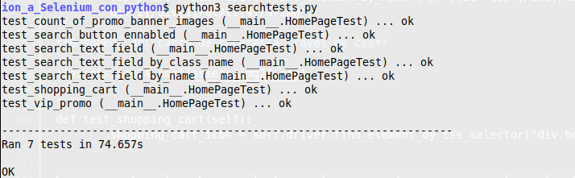

Tener en cuenta que el Xpath puede no ser la mejor opcion porque las rutas pueden cambiar

## Clase 7 Preparar assertions y test suites

Assertions son los métodos que permiten validar un valor esperado en la ejecución del test. Si el resultado es verdadero el test continúa, en caso contrario "falla" y termina.

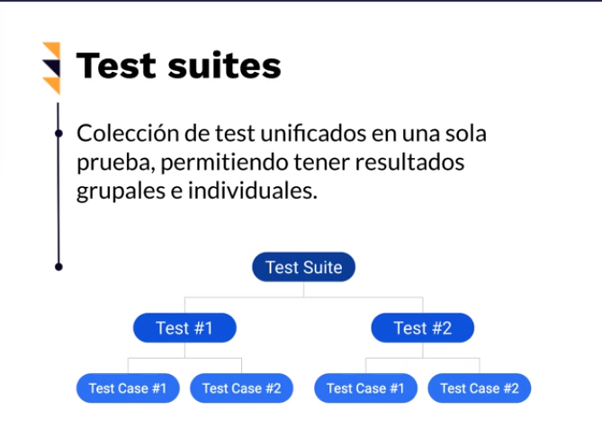

Son una coleccion de pruebas unificadas en un archivo como por ejemplo tener pruebas del login, del home y otras secciones. Pero en lugar de estar corriendo un archivo de forma independiente y esperar que termine, se puede unificar en un test suite el cual al correr las pruebas no se van a ejecutar en paralelo, si no, de forma secuencial

Para esta clase se crean varios archivos que son **assertions.py**, **searchtests.py**(el cual es de la clase anterior pero cambian algunas cosas del codigo) y **smoketests.py**, a continuacion dejo los codigos de cada uno en el orden que fueron mencionados

**assertions.py**

```
import unittest
from selenium import webdriver
from selenium.common.exceptions import NoSuchElementException
from selenium.webdriver.common.by import By

class AssertionsTest(unittest.TestCase):
    

    def setUp(self):
        self.driver = webdriver.Chrome(executable_path= './chromedriver')
        driver = self.driver
        driver.implicitly_wait(30)
        driver.maximize_window()
        driver.get("http://demo-store.seleniumacademy.com/")
        
    def test_search_field(self):
        self.assertTrue(self.is_element_present(By.NAME, 'q'))
        
    def test_language_option(self):
        self.assertTrue(self.is_element_present(By.ID, 'select-language'))
          
    def tearDown(self):
        self.driver.quit()
        
    def is_element_present(self, how, what):
        try:
            self.driver.find_element(by = how, value = what)
        except NoSuchElementException as variable:
            return False
        return True
```

**Para la clase 7 el codigo cambia en los archivos por lo cual los dejare entre comentarios por si hay alguna duda y se pueda ejecutar el codigo**

**searchtests.py**

```
import unittest

from selenium import webdriver

class SearchTests(unittest.TestCase):
    

    def setUp(self):
        self.driver = webdriver.Chrome(executable_path= './chromedriver')
        driver = self.driver
        driver.get("http://demo-store.seleniumacademy.com/")
        driver.maximize_window()
        driver.implicitly_wait(15)


    def test_search_tee(self):
        driver = self.driver
        search_field = driver.find_element_by_name('q')
        search_field.clear()

        search_field.send_keys('tee')
        search_field.submit()


    def test_search_salt_shaker(self):
        driver = self.driver
        search_field = driver.find_element_by_name('q')

        search_field.send_keys('salt shaker')
        search_field.submit()

        products = driver.find_elements_by_xpath('//*[@id="top"]/body/div/div[2]/div[2]/div/div[2]/div[2]/div[3]/ul/li/div/h2/a')
        self.assertEqual(1, len(products))


    def tearDown(self):
        self.driver.quit()


if __name__ == "__main__":
    unittest.main(verbosity= 2)
```


**smoketests.py**


```
from unittest import TestLoader, TestSuite
from pyunitreport import HTMLTestRunner
from assertions import AssertionsTest
from searchtests import SearchTests


assertions_test = TestLoader().loadTestsFromTestCase(AssertionsTest)
search_tests = TestLoader().loadTestsFromTestCase(SearchTests)

#Construccion de suite de pruebas
smoke_test = TestSuite([assertions_test, search_tests])

#Respecto a los reportes

kwargs = {
    "output": 'smoke-report'
    }

runner = HTMLTestRunner(**kwargs)
runner.run(smoke_test)
```
Despues de grabar estos archivos se ejecuta el archivo smoketests.py para ver que estan corriendo OK. apoyarse igualmente de los videos de Platzi para comprender mejor el codigo 

## Clase 8 Entender las clases WebDriver y WebElement

Como viste en clases anteriores, un sitio web se construye por código **HTML** en forma de árbol, conteniendo distintos elementos con los que podemos interactuar según estén presentes o no en nuestra interfaz gráfica.

**Selenium WebDriver** nos brinda la posibilidad de poder referirnos a estos elementos y ejecutar métodos específicos para realizar las mismas acciones que un humano haría sobre los mismos, gracias a las clases **WebDriver** y **WebElement**.

**Clase WebDriver**

Cuenta con una serie de propiedades y métodos para interactuar directamente con la ventana del navegador y sus elementos relacionados, como son pop-ups o alerts. Por ahora nos centraremos a las más utilizadas.

**Propiedades de la clase WebDriver**

Estas son las más comunes para acceder al navegador.

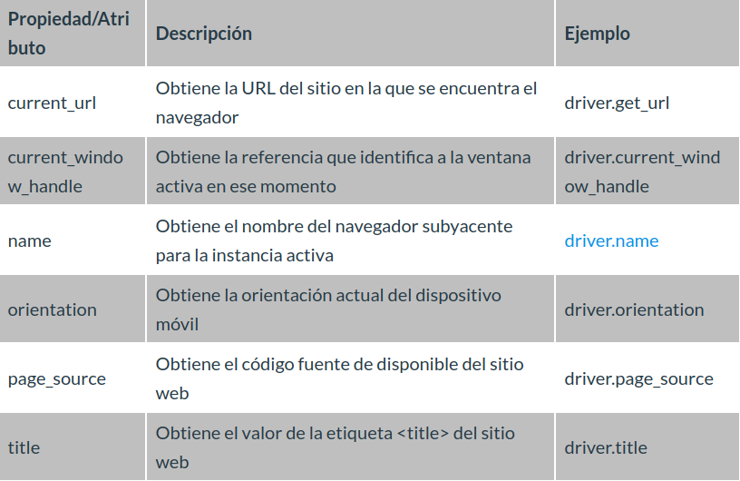

**Clase WebElement**

Esta clase nos permite interactuar específicamente con elementos de los sitios web como textbox, text area, button, radio button, checkbox, etc.

**Propiedades más comunes de la clase WebElement**

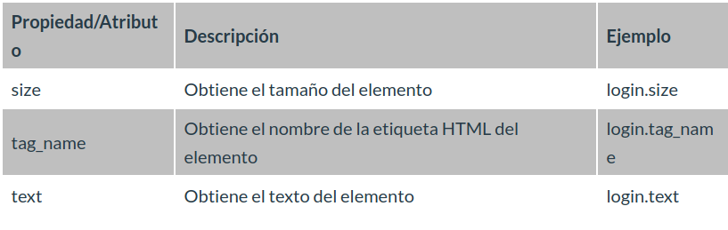

**Métodos más comunes de la clase WebElement**

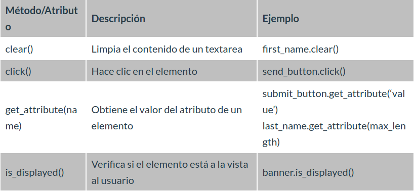

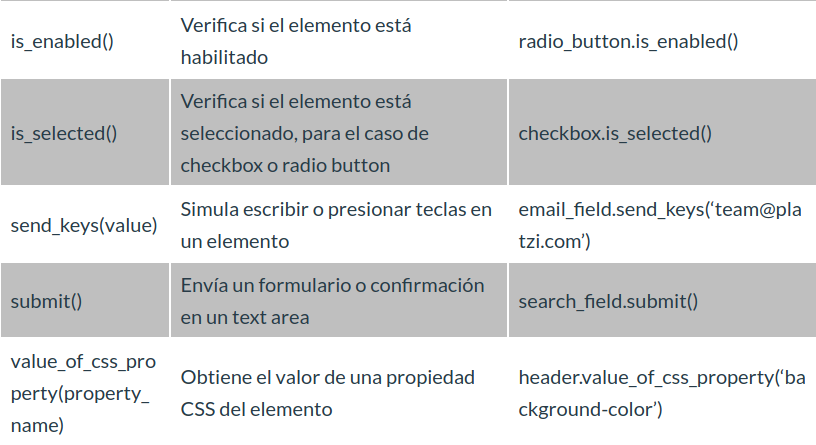

## Clase 9 Manejar form, textbox, checkbox y radio button

Para esta clase lo que se va a realizar es validar que tanto los campos como las validaciones de ingresos de formulario para crear una cuenta esten de manera correcta. verificar video y a continuacion el archivo el cual se llama **register_new_usser.py**, posteriormente ejecutarlo en la consola para comprobar que es lo que se esta realizando en cada paso

```
import unittest
from selenium import webdriver

class RegisterNewUser(unittest.TestCase):

    def setUp(self):
        self.driver = webdriver.Chrome(executable_path  = './chromedriver')
        driver = self.driver
        driver.implicitly_wait(30)
        driver.maximize_window()
        driver.get("http://demo-store.seleniumacademy.com/")


    def test_new_user(self):
        driver = self.driver
        driver.find_element_by_xpath('/html/body/div/div[2]/header/div/div[2]/div/a/span[2]').click()
        driver.find_element_by_link_text('Log In').click()

        create_account_button = driver.find_element_by_xpath('/html/body/div/div[2]/div[2]/div/div/div[2]/form/div/div[1]/div[2]/a/span/span')
        self.assertTrue(create_account_button.is_displayed() and create_account_button.is_enabled())
        create_account_button.click()

        self.assertEqual('Create New Customer Account', driver.title)


        first_name = driver.find_element_by_id('firstname')
        middle_name = driver.find_element_by_id('middlename')
        last_name = driver.find_element_by_id('lastname')
        email_address = driver.find_element_by_id('email_address')
        news_letter_subscription = driver.find_element_by_id('is_subscribed') 
        password = driver.find_element_by_id('password')
        confirm_password = driver.find_element_by_id('confirmation')
        submit_button = driver.find_element_by_xpath('/html/body/div/div[2]/div[2]/div/div/div[2]/form/div[2]/button')


        self.assertTrue(first_name.is_enabled()
        and middle_name.is_enabled()
        and last_name.is_enabled()
        and email_address.is_enabled()
        and news_letter_subscription.is_enabled()
        and password.is_enabled()
        and confirm_password.is_enabled()
        and submit_button.is_enabled())

        first_name.send_keys('Test')
        last_name.send_keys('Test')
        middle_name.send_keys('Test')
        email_address.send_keys('Test@testingmail.com')
        news_letter_subscription.send_keys('Test')
        password.send_keys('Test')
        confirm_password.send_keys('Test')
        submit_button.click()

    def tearDown(self):
        self.driver.implicitly_wait(3)
        self.driver.close()


if __name__ == "__main__":
    unittest.main(verbosity= 2)
    
```

## Clase 10 Manejar dropdown y listas

Los dropdown son menus desplegables donde se pueden encontrar diversas opciones y se puede acceder a ellas para elergirlas de forma automatizada, ya sea por el texto visible, orden en su indice o valor que se tiene asignado en su codigo html

En esta clase se usa la estructura basica en el codigo que se ha venido manejando pero el nombre del archivo y clase cambia, en esta clase se importa el modulo Select y se va a trabajar sobre el menu despleagable de los idiomas a continuacion:


**select_language.py**

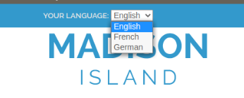

```
import unittest

from selenium import webdriver

from selenium.webdriver.support.ui import Select

class LanguageOptions(unittest.TestCase):

    def setUp(self):
        self.driver = webdriver.Chrome(executable_path= './chromedriver')
        driver = self.driver
        driver.implicitly_wait(30)
        driver.maximize_window()
        driver.get('http://demo-store.seleniumacademy.com/')


    def test_select_language(self):
        exp_options = ['English', 'French', 'German']
        act_options = []

        select_language = Select(self.driver.find_element_by_id('select-language'))

        self.assertEqual(3, len(select_language.options))

        for option in select_language.options:
            act_options.append(option.text)

        self.assertListEqual(exp_options, act_options)

        self.assertEqual('English', select_language.first_selected_option.text)

        select_language.select_by_visible_text('German')

        self.assertTrue('store=german' in self.driver.current_url)

        select_language = Select(self.driver.find_element_by_id('select-language'))
        select_language.select_by_index(0)

    def tearDown(self):
        self.driver.implicitly_wait(3)
        self.driver.close()


if __name__ == "__main__":
    unittest.main(verbosity= 2)
```

## Clase 11 Manejar alert y pop-up 

Los elementos alert y pop-up, aparecen repentinamente y estos en ocasiones piden la confirmacion o negacion de algo, incluso que se escriba en el teclado informacion para que sea enviada, pero estos tambien se pueden automatizar con Selenium

En esta clase se va a tratar uno de estos elementos, en la seccion de busqueda colocar la palabra tee,

luego dar click en add to compare y finalmente en Clear All para que aparezca una ventana emergente como se muestra continuacion:

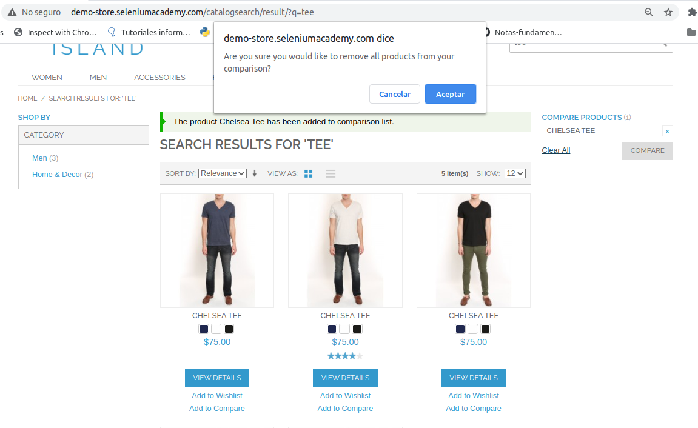

y a continuacion el codigo del archivo trabajado para la clase, contiene la misma estrcutura basica de clases anteriores 

**alerts.py**

```
import unittest

from selenium import webdriver


class CompareProducts(unittest.TestCase):

    def setUp(self):
        self.driver = webdriver.Chrome(executable_path = './chromedriver')
        driver = self.driver
        driver.implicitly_wait(30)
        driver.maximize_window()
        driver.get('http://demo-store.seleniumacademy.com/')

    def test_compare_products_removal_alert(self):
        driver = self.driver
        search_field = driver.find_element_by_name('q')
        search_field.clear()

        search_field.send_keys('tee')
        search_field.submit()

        driver.find_element_by_class_name('link-compare').click()
        driver.find_element_by_link_text('Clear All').click()

        alert = driver.switch_to_alert()
        alert_text = alert.text

        self.assertEqual('Are you sure you would like to remove all products from your comparison?', alert_text)

        alert.accept()


    def tearDown(self):
        self.driver.close()


if __name__ == "__main__":
    unittest.main(verbosity = 2)
```

## Clase 12 Automatizar navegación

Otras acciones que se deben automatizar son las acciones del sitio web como avanzar, retroceder en el historial de navegacion, recargar pagina y otras opciones, la que se va a realizar en el codigo son las mas basicas y conocidas.

En esta clase se utiliza el modulo time para hacer demorar un poco la busqueda de platzi en el buscador de google y se pasan por parametro 3 metodos

**back() ->** el cual sirve para retroceder
**forward() ->** el cual sirve para avanzar
**refresh() ->** el cual sirve para refrescar la pagina

**automatic_navigation.py**

```
import unittest
from selenium import webdriver
from time import sleep

class NavigationTest(unittest.TestCase):

    def setUp(self):

        self.driver = webdriver.Chrome(executable_path = './chromedriver')
        driver = self.driver
        driver.implicitly_wait(30)
        driver.maximize_window()
        driver.get('https://google.com/')

    
    def test_browser_navigation(self):
        driver = self.driver
        search_field = driver.find_element_by_name('q')
        search_field.clear()
        search_field.send_keys('platzi')
        search_field.submit()

        driver.back()
        sleep(3)
        driver.forward()
        sleep(3)
        driver.refresh()
        sleep(3)

    def tearDown(self):
        self.driver.close()


if __name__ == "__main__":

    unittest.main(verbosity = 2)

```

## Clase 13 Demora implícita y explícita

Las pausas ayudan a manejar el asincronismo, la cual es una de las debilidades de Selenium y se puede encontrar como:

- **Demora implicita :** Va a buscar un elemento en el DOM, en el caso de que lo encuentre va a continuar, para ello va a esperar una cantidad de tiempo determinado estas pausas, en el pasado se han usado con **implicitly_wait**

- **Demora explicita :** Estas esperan a que se cumpla una condicion determinada de acuerdo a un set de condiciones que ya existen

A continuacion el codigo del ejercicio el cual consiste en validar los idiomas de la pagina y en poder acceder a traver de cuenta y hacer la seleccion de mi cuenta para poder hacer registro, despues del codigo la explicación del mismo

**waits.py**

```
import unittest
from selenium import webdriver
from selenium.webdriver.common.by import By
from selenium.webdriver.support.ui import WebDriverWait
from selenium.webdriver.support import expected_conditions as EC

class ExplicitiWaitTest(unittest.TestCase):

    def setUp(self):

        self.driver = webdriver.Chrome(executable_path = './chromedriver')
        self.driver.get('http://demo-store.seleniumacademy.com')


    def test_account_link(self):
        WebDriverWait(self.driver, 10).until(lambda s: s.find_element_by_id('select-language').get_attribute('length') == '3')

        account = WebDriverWait(self.driver, 10).until(EC.visibility_of_element_located((By.LINK_TEXT, 'ACCOUNT')))
        account.click()

    
    def test_create_new_costumer(self):
        self.driver.find_element_by_link_text('ACCOUNT').click()

        my_account = WebDriverWait(self.driver, 10).until(EC.visibility_of_element_located((By.LINK_TEXT, 'My Account')))  
        my_account.click()

        create_account_button = WebDriverWait(self.driver, 20).until(EC.element_to_be_clickable((By.LINK_TEXT, 'CREATE AN ACCOUNT')))
        create_account_button.click()

        WebDriverWait(self.driver, 10).until(EC.title_contains('Create New Customer Account'))


    def tearDown(self):
        self.driver.close()


if __name__ == "__main__":
    unittest.main(verbosity = 2)
```

Lo primero que se hace es importar:

```
from selenium.webdriver.common.by import By #Nos ayuda a hacer referencia a un elemento del sitio web a traves de sus selectores, no para identificarlo si no para interactuar distinto a como lo hace webdriver
from selenium.webdriver.support.ui import WebDriverWait # Permite hacer uso de las expected conditions junto con las esperas explicitas
from selenium.webdriver.support import expected_conditions as EC # Permite hacer uso de las esperas explicitas, al final se nombran como EC para no estarlas llamando por su nombre completo
```

Configuracion de los metodos de prueba:

```
    def test_account_link(self):
        WebDriverWait(self.driver, 10).until(lambda s: s.find_element_by_id('select-language').get_attribute('length') == '3') # WebDriverWait hace referencia a self.driver y esperara 10 segundos, lambda(hace referencia a cumplir la condicion esperada), luego lo que se hace es buscar su elemento por id y obtener el atributo por su longitud la cual se sabe que es 3 porque son 3 idiomas

        account = WebDriverWait(self.driver, 10).until(EC.visibility_of_element_located((By.LINK_TEXT, 'ACCOUNT'))) #Aqui se hace referencia para ir al enlace de cuentas de la pagina, igualmente se crea na variable, se indica que espere maximo 10 segundos, EC es la espera explicita y luego se indica a traves de LINK_TEXT la busqueda del elemento en el link el cual especificamente se llama ACCOUNT
        account.click()
```

```
    def test_create_new_costumer(self): # se crea la funcion test para validar la cuenta
        self.driver.find_element_by_link_text('ACCOUNT').click() # al hacer click en ACCOUNT se despliega la opcion My Account el cual es la siguiente intruccion de codigo

        my_account = WebDriverWait(self.driver, 10).until(EC.visibility_of_element_located((By.LINK_TEXT, 'My Account')))  
        my_account.click() # Despues de hacer click sobre este se abre otra pagina que en su head se encuentra el titulo de la pagina el cual es (Create New Customer Account)  donde se puede hacer la creacion de cuenta en CREATE AN ACCOUNT el cual es la siguiente linea de codigo

        create_account_button = WebDriverWait(self.driver, 20).until(EC.element_to_be_clickable((By.LINK_TEXT, 'CREATE AN ACCOUNT')))
        create_account_button.click()

        WebDriverWait(self.driver, 10).until(EC.title_contains('Create New Customer Account'))

```

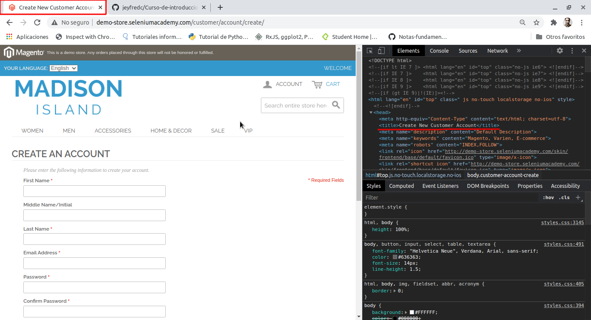

## Clase 14 Condicionales esperadas

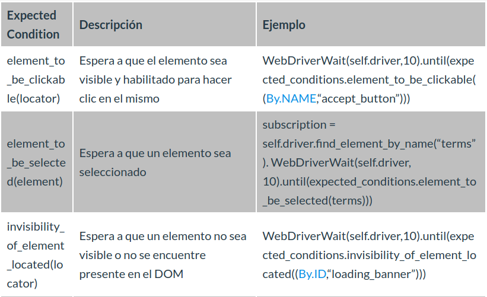

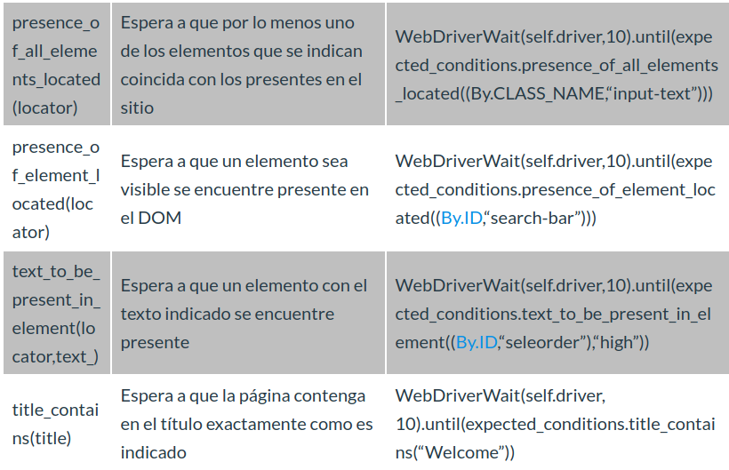


## Clase 15 Agregar y eliminar elementos

Esta clase es un reto del curso de platzi donde se intenta controlar el ejercicio en la siguiente pagina https://the-internet.herokuapp.com/ el ejercicio se llama **Add/Remove Elements** , es el segundo que se encuentra en ella, se pueden agregar y remover elementos.

El ejercicio consiste en agregar elementos, los cuales se piden por consola, luego preguntar por consola cuantos se quiere remover, en el caso de que el usuario escriba que remueva mas elementos de los que agrego, si no se controla a traves de un try, except el programa va a arrojar un error y terminar su ejecucion. El reto esta en intentar controlar de otra forma. A continuacion el codigo de la clase 

**add_remove_elements.py**
```
import unittest
from selenium import webdriver
from time import sleep

class AddRemoveElements(unittest.TestCase):

    def setUp(self):

        self.driver = webdriver.Chrome(executable_path = './chromedriver')
        driver = self.driver
        driver.get('https://the-internet.herokuapp.com/')
        driver.find_element_by_link_text('Add/Remove Elements').click()

    
    def test_add_remove(self):
        driver = self.driver

        elements_added = int(input('How many elements will you add?: '))
        elements_removed = int(input('How many elements will you remove?: '))
        total_elements = elements_added - elements_removed

        add_button = driver.find_element_by_xpath('//*[@id="content"]/div/button')

        sleep(3)

        for i in range(elements_added):
            add_button.click()

        for i in range(elements_removed):
            try:
                delete_button = driver.find_element_by_xpath('//*[@id="elements"]/button[1]')
                delete_button.click()

            except:
                print("You're tryin to delete more elements the the existent")
                break


        if total_elements > 0:
            print(f'There are {total_elements} elements on screen')
        else:
            print('There 0 are elements of screen')

        sleep(3)


    def tearDown(self):
        self.driver.close()


if __name__ == "__main__":
    unittest.main(verbosity = 2)
```

## Clase 16 Elementos dinámicos

Esta clase es un reto del curso de platzi donde se intenta controlar el ejercicio en la siguiente pagina https://the-internet.herokuapp.com/ el ejercicio se llama **Disappearing Elements**, en este ejercicio lo que hay que hacer es controlar el numero de veces que aparece Gallery, ya que aparece y desaparece aleatoriamente dentro de la pagina


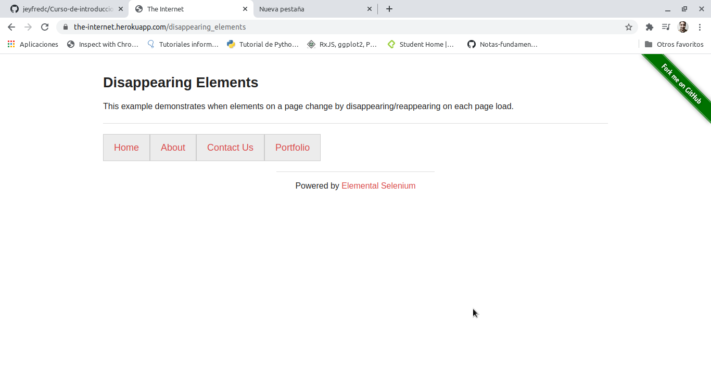

**dynamic_elements.py**
```
import unittest
from selenium import webdriver

class DynamicElements(unittest.TestCase):

    def setUp(self):
        self.driver = webdriver.Chrome(executable_path = './chromedriver')
        driver = self.driver
        driver.get('https://the-internet.herokuapp.com/')
        driver.find_element_by_link_text('Disappearing Elements').click()

    
    def test_name_elements(self):
        driver = self.driver

        options = []
        menu = 5 
        tries = 1

        while len(options) <5:
            options.clear()

            for i in range(menu):
                try:
                    option_name = driver.find_element_by_xpath(f"/html/body/div[2]/div/div/ul/li[{i + 1}]/a")
                    options.append(option_name.text)
                    print(options)
                except:
                    print(f'Option number {i + 1} is NOT FOUND')
                    tries += 1
                    driver.refresh()

        print(f'Finished in {tries} tries')


    def tearDown(self):
        self.driver.close()


if __name__ == "__main__":
    unittest.main(verbosity = 2)
```

## Clase 17 Controles dinámicos

Esta clase es un reto del curso de platzi donde se intenta controlar el ejercicio en la siguiente pagina https://the-internet.herokuapp.com/ el ejercicio se llama **Dynamic Controls**, en este ejercicio lo que hay que hacer es controlar la ejecucion de checkbox y un formulario que se encuentra deshabilitado, para hacer click en ellos habilitarlos y en el campo del formulario de texto ingresar una palabra, se debe implementar demora explicita para poder realizar el control ya que al habilitar los botones nuevamente la pagina queda en ejecucion

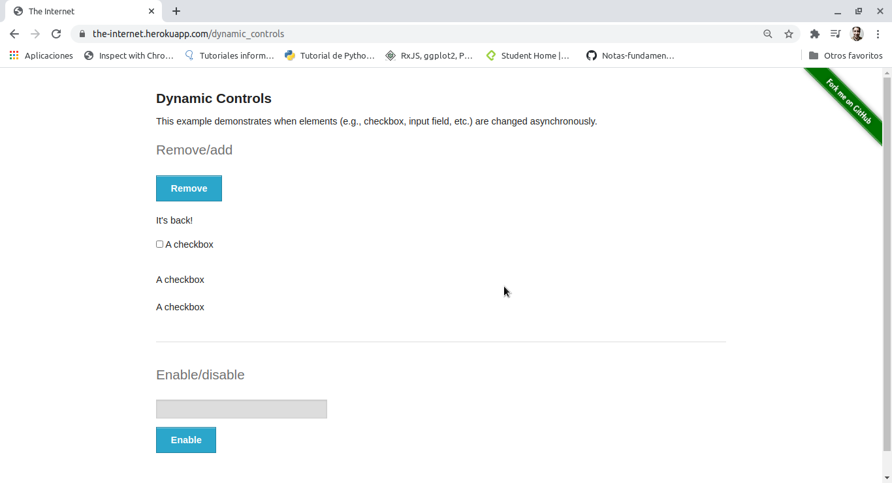

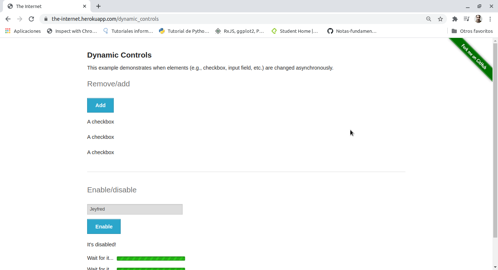

**dynamic_controls.py**

```
import unittest
from selenium import webdriver
from selenium.webdriver.common.by import By
from selenium.webdriver.support.ui import WebDriverWait
from selenium.webdriver.support import expected_conditions as EC

class DynamicControl(unittest.TestCase):

    def setUp(self):
        self.driver = webdriver.Chrome(executable_path= './chromedriver')
        driver = self.driver
        driver.get('https://the-internet.herokuapp.com/')
        driver.find_element_by_link_text('Dynamic Controls').click()

    def test_check_box(self):
        driver = self.driver

        checkbox= driver.find_element_by_css_selector('#checkbox')
        checkbox.click()

        remove_add_button = driver.find_element_by_css_selector('#checkbox-example > button')
        remove_add_button.click()

        WebDriverWait(driver, 15).until(EC.element_to_be_clickable((By.CSS_SELECTOR, "#checkbox-example > button")))
        remove_add_button.click()

        enable_disable_button = driver.find_element_by_css_selector('#input-example > button')
        enable_disable_button.click()

        WebDriverWait(driver, 15).until(EC.element_to_be_clickable((By.CSS_SELECTOR, '#input-example > button')))
        
        text_area = driver.find_element_by_css_selector('#input-example > input[type=text]')
        text_area.send_keys('Jeyfred')

        enable_disable_button.click()
        

    def test_button_enabled(self):
        pass


    def tearDown(self):
        self.driver.close()


if __name__ == "__main__":
    unittest.main(verbosity = 2)
```

## Clase 18 Typos

Esta clase es un reto del curso de platzi donde se intenta controlar el ejercicio en la siguiente pagina https://the-internet.herokuapp.com/ el ejercicio se llama **Typos**, en este ejercicio lo que hay que hacer es verificar que este parrafo de texto este bien escrito "Sometimes you'll see a typo, other times you won't." ya que al recargar la pagina puede aparecer correctamente como no, especificamente el error esta en la palabra **won't** la cual en ocasiones aparece como **won,t**

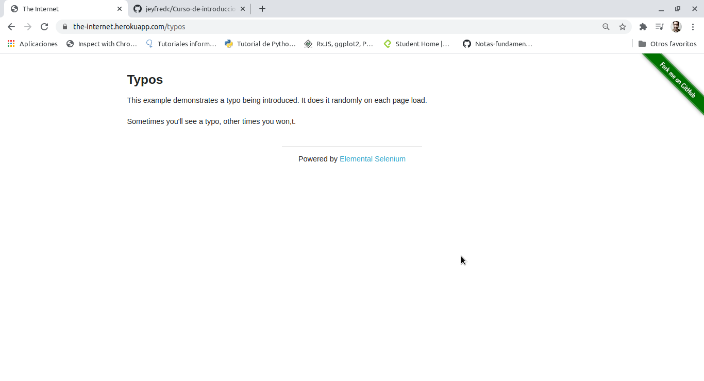


**typos.py**
```
import unittest
from selenium import webdriver

class Typos(unittest.TestCase):

    def setUp(self):
        self.driver = webdriver.Chrome(executable_path= './chromedriver')
        driver = self.driver
        driver.get('https://the-internet.herokuapp.com/')
        driver.find_element_by_link_text('Typos').click()


    def test_find_typo(self):
        driver = self.driver

        paragraph_to_check = driver.find_element_by_css_selector('#content > div > p:nth-child(3)')
        text_to_check = paragraph_to_check.text
        print(text_to_check)

        tries = 1
        found = False
        correct_text = "Sometimes you'll see a typo, other times you won't."


        while text_to_check != correct_text:
            paragraph_to_check = driver.find_element_by_css_selector('#content > div > p:nth-child(3)')
            text_to_check = paragraph_to_check.text
            driver.refresh()

        while not found:
            if text_to_check == correct_text:
                tries +=1
                driver.refresh()
                found = True

        self.assertEqual(found, True)


        print(f"It took {tries} tries to find the typo")

    def tearDown(self):

        self.driver.close()


if __name__ == "__main__":
    unittest.main(verbosity = 2)
```

## Clase 19 Ordenar tablas

Esta clase es un reto del curso de platzi donde se intenta controlar el ejercicio en la siguiente pagina https://the-internet.herokuapp.com/ el ejercicio se llama **Sortable Data Tables**, en este ejercicio lo que hay que hacer es ordenar y obtener los elementos de la primera tabla en el orden que se encuentran

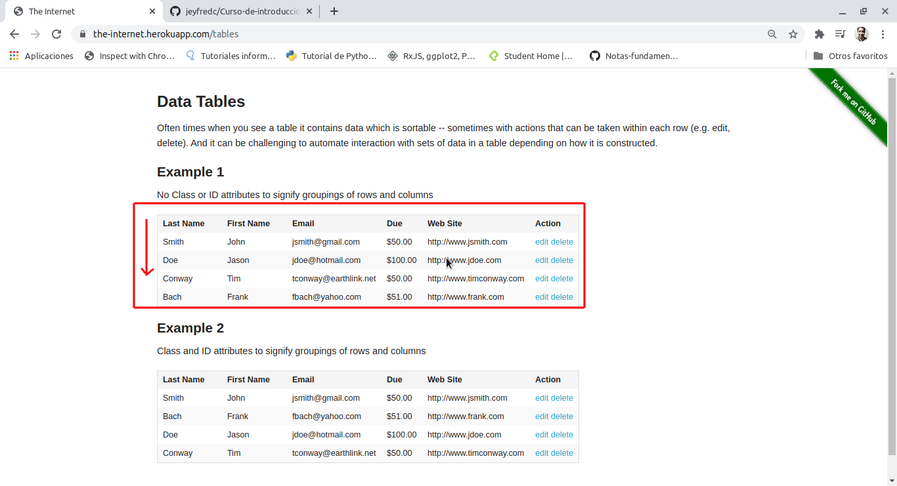

**tables.py**

```
import unittest
from selenium import webdriver

class Tables(unittest.TestCase):

    def setUp(self):
        self.driver = webdriver.Chrome(executable_path = './chromedriver')
        driver = self.driver
        driver.get('https://the-internet.herokuapp.com/')
        driver.find_element_by_link_text('Sortable Data Tables').click()


    def test_sort_tables(self):
        driver = self.driver

        table_data = [[] for i in range(5)]
        print(table_data)

        for i in range (5):
            header = driver.find_element_by_xpath(f'//*[@id="table1"]/thead/tr/th[{i + 1}]')
            table_data[i].append(header.text)
            

            for j in range(4):
                row_data = driver.find_element_by_xpath(f'//*[@id="table1"]/tbody/tr[{j + 1}]/td[{i + 1}]')
                table_data[i].append(row_data.text)


        print(table_data)

    def tearDown(self):
        self.driver.close()


if __name__ == "__main__":
    unittest.main(verbosity = 2)
```

## Clase 20 Data Driven Testing (DDT)

Es una metodologia utilizada en el testing de software que se puede implementar en Selenium y esto ayuda a que las automatizaciones sean mucho mas robustas y versatiles, ademas, se debe tener en cuenta que esto es algo distinto al TDD(Test Driven Depelopment)

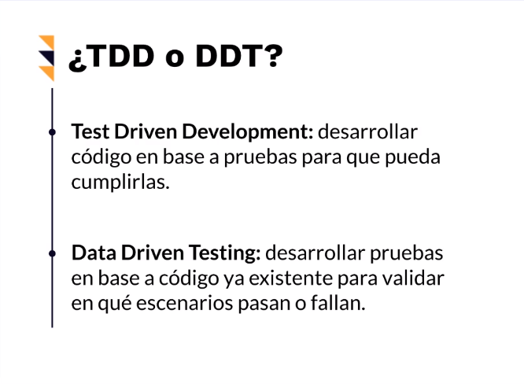

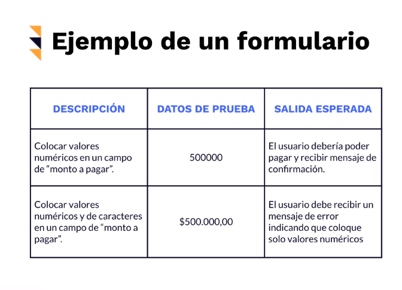

Para esta clase lo primero que hay que hacer es abrir la terminal e instalar el modulo ddt mediante la siguiente instruccion, recordar que esta instruccion depende del sistema operativo, en este caso es linux mint o los basados en ubuntu o debian.:

- pip3 install ddt

Despues se importan los modulos csv para abrir la tabla de datos del curso llamada **testdata.csv**, de la cual se cargaran datos en la opcion de busqueda de la pagina que se ha venido trabajando a lo largo de todo el curso para realizar las respectivas validaciones y verificar que los datos esten correctos

**search_ddt.py**

```
import csv, unittest
from ddt import ddt, data, unpack
from selenium import webdriver

def get_data(file_name):
    rows = []
    data_file = open(file_name, 'r')
    reader = csv.reader(data_file)
    next(reader, None)

    for row in reader:
        rows.append(row)
    return rows


@ddt
class SearchDDT(unittest.TestCase):

    def setUp(self):
        self.driver = webdriver.Chrome(executable_path = './chromedriver')
        driver = self.driver
        driver.implicitly_wait(30)
        driver.maximize_window()
        driver.get('http://demo-store.seleniumacademy.com/')

    @data(*get_data('testdata.csv'))
    @unpack
    
    def test_search_ddt(self, search_value, expected_count):
        driver = self.driver

        search_field = driver.find_element_by_name('q')
        search_field.clear()
        search_field.send_keys(search_value)
        search_field.submit()

        products = driver.find_elements_by_xpath('//h2[@class="product-name"]/a')
        print(f'Found {len(products)} products')

        expected_count = int(expected_count)

        if expected_count > 0:
            self.assertEqual(expected_count, len(products))
        else:
            message = driver.find_element_by_class_name('note-msg')
            self.assertEqual('Your search returns no results.', message)

        for product in products:
            print(product.text)

            self.assertEqual(expected_count, len(products))

        print(f'Found {len(products)} products')

    def tearDown(self):
        self.driver.close()


if __name__ == "__main__":
    unittest.main(verbosity = 2)
```

## Clase 21 Page Object Model (POM)

POM es un patron de diseño utilizado en testing que brinda diversos beneficios para las automatizaciones

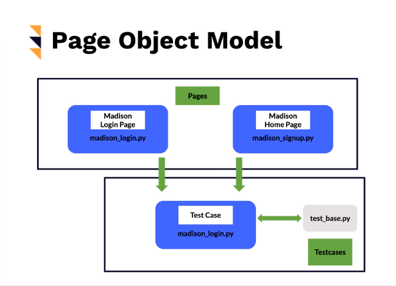

La manera en la que funciona es que en lugar de tener las pruebas en un solo archivo, se manejan archivos independientes los cuales se les llama pages, haciendo referencia al sitio donde se aplican

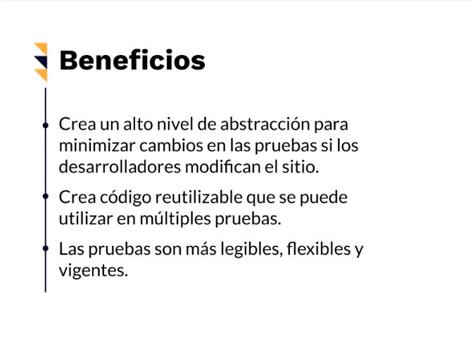

para este clase se crea una carpeta llamada **pom** donde se agregan 2 archivos, el primero llamado **google_page.py** y el segundo **test_google.py** en donde se ejecutara la prueba

**google_page.py**

```
from selenium import webdriver
from selenium.webdriver.common.by import By
from selenium.webdriver.support.ui import WebDriverWait
from selenium.webdriver.support import expected_conditions as EC


class GooglePage(object):

    def __init__(self, driver):
        self._driver = driver
        self._url = 'https://google.com'
        self.search_locator = 'q'


    @property
    def is_loaded(self):
        WebDriverWait(self._driver, 10).until(EC.presence_of_element_located((By.NAME, 'q')))
        return True
    
    @property
    def keyword(self):
        input_field = self._driver.find_element_by_name('q')
        return input_field.get_attribute('value')


    def open(self):
        self._driver.get(self._url)

    
    def type_search(self, keyword):
        input_field = self._driver.find_element_by_name('q')
        input_field.send_keys(keyword)

    
    def click_submit(self):
        input_field = self._driver.find_element_by_name('q')
        input_field.submit()


    def search(self, keyword):
        self.type_search(keyword)
        self.click_submit


```

**test_google.py**

```
import unittest
from selenium import webdriver
from google_page import GooglePage

class GoogleTest(unittest.TestCase):

    @classmethod
    def setUp(cls):
        cls.driver = webdriver.Chrome(executable_path = '../chromedriver')

    
    def test_search(self):
        google = GooglePage(self.driver)
        google.open()
        google.search('Platzi')

        self.assertEqual('Platzi', google.keyword)


    @classmethod
    def tearDown(cls):
        cls.driver.close()


if __name__ == "__main__":
    unittest.main(verbosity = 2)
```

## Clase 22 Realizar una prueba técnica

Recomendaciones para el aprendizaje y refuerzo de las pruebas automatizadas

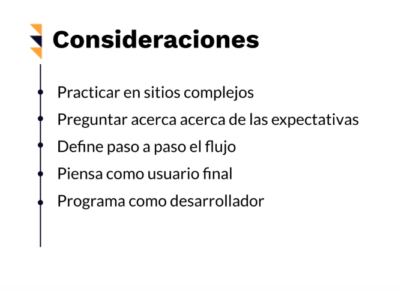

**Ejercicio de clase**

En este ejercicio cambiaron algunos elementos de la pagina pero tal y como esta al 1-09-2020, esta funcionando

**mercadolibre.py**

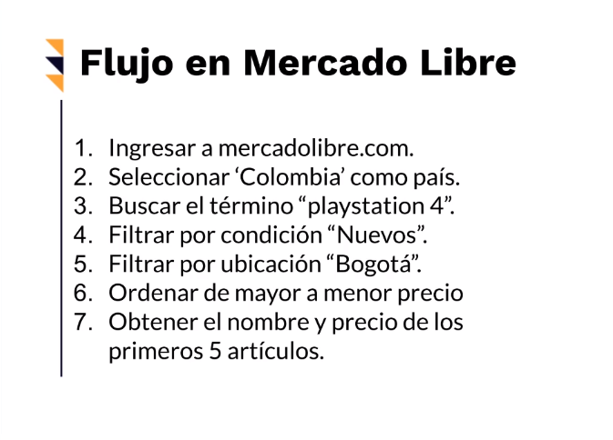

```
import unittest
from selenium import webdriver
from time import sleep

class TestingMercadoLibre(unittest.TestCase):

    def setUp(self):
        self.driver = webdriver.Chrome(executable_path = './chromedriver')
        driver = self.driver
        driver.get('https://www.mercadolibre.com')
        driver.maximize_window()

    
    def test_search_ps4(self):
        driver = self.driver

        country = driver.find_element_by_id('CO')
        country.click()

        search_field = driver.find_element_by_name('as_word')
        search_field.click()
        search_field.clear()
        search_field.send_keys('playstation 4')
        search_field.submit()
        sleep(3)

        location = driver.find_element_by_partial_link_text('Bogotá D.C.')
        location.click()
        sleep(3)

        condition = driver.find_element_by_partial_link_text('Nuevo')
        condition.click()
        sleep(3)

        order_menu = driver.find_element_by_class_name('andes-dropdown__trigger')
        order_menu.click()
        higher_price = driver.find_element_by_css_selector('#root-app > div > div > aside > section.ui-search-view-options > div.ui-search-view-options__group > div.ui-search-sort-filter > div > div > div > ul > li:nth-child(3) > div > div')
        higher_price.click()
        sleep(3)

        articles = []

        prices = []

        for i in range(5):
            article_name = driver.find_element_by_xpath(f'//*[@id="root-app"]/div/div/section/ol/li[{i + 1}]/div/div/div[2]/div[1]/a/h2').text
            articles.append(article_name)
            article_price = driver.find_element_by_xpath(f'/html/body/main/div/div/section/ol/li[{i + 1}]/div/div/div[2]/div[2]/div/div/span[1]/span[2]').text
            prices.append(article_price)

        print(articles, prices)

    def tearDown(self):
        self.driver.close()


if __name__ == "__main__":
    unittest.main(verbosity = 2)
```
## Clase 23 Conclusiones

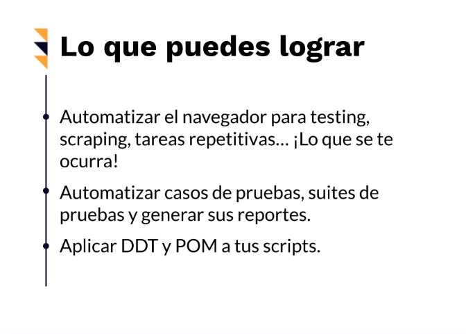

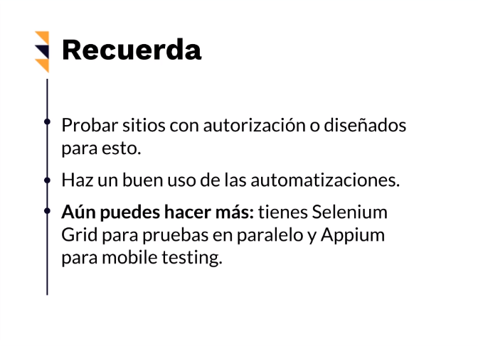

___

## ¿Quieres conocer mas proyectos?

Puedes visualizar mi portafolio en el siguiente enlace https://jeyfredc.github.io/Portafolio/Css-Portafolio/

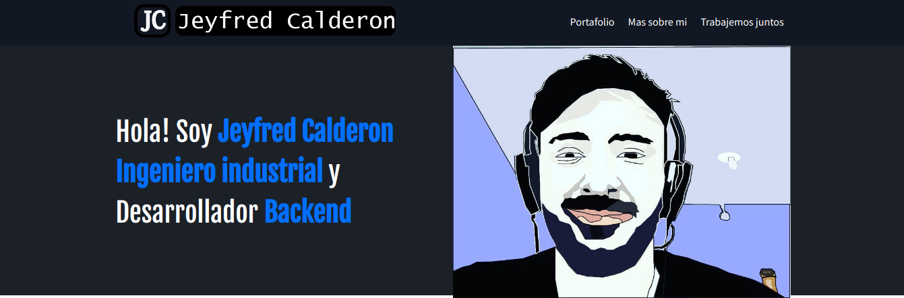